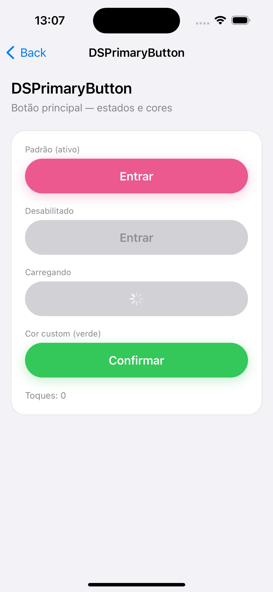
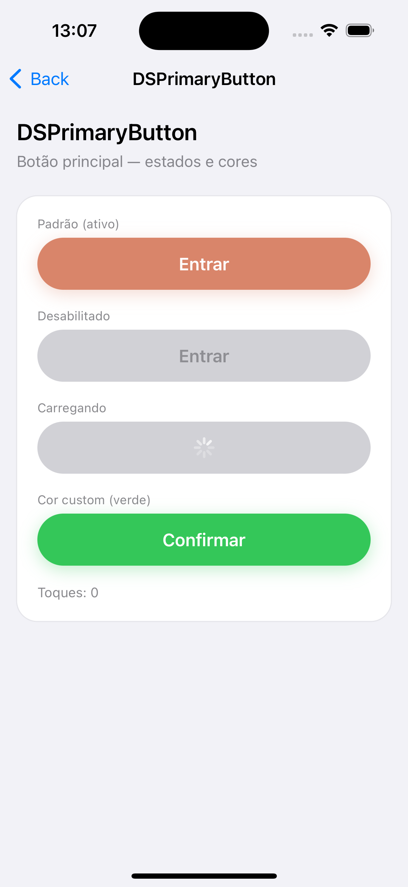

<h1 align="center">🎨 FastNails Design System</h1>

<p align="center">
  <strong>A reusable SwiftUI component library that powers the FastNails app.</strong>
</p>

<p align="center">
  
  
  
  
</p>

<br/>

## 📱 About

The **FastNails Design System** (`UIComponents`) is a standalone Swift Package that centralizes every reusable piece of UI used across the FastNails app: buttons, forms, feedback banners, cards, navigation and profile components.

It exists as an **independent module** — separate from the app target — for a simple reason: UI code that lives inside the app tends to drift, get duplicated per screen, and lose consistency over time. By pulling it into its own package, the design system can be developed, versioned, tested and reviewed on its own, and every screen in the app consumes the exact same source of truth instead of a copy of it.

The package is built around three principles:

- **One source of truth.** Colors, typography, spacing and corner radius are never hardcoded in a screen — they come from design tokens (`DSTheme`, `DSSpacing`, `DSRadius`, `DSFont`), so a single change propagates everywhere.
- **Accessible by default, not by afterthought.** Every component ships with VoiceOver labels and reading order, Dynamic Type support, and colors with documented contrast ratios — this is enforced at the component level, not left for each screen to remember.
- **Documented at the source.** Every public component carries a doc comment with a compilable usage example, so the answer to "how do I use this?" lives next to the code, not only in this README.

<br/>

## ✨ Highlights

- 🧩 **27+ ready-made components** — buttons, forms, feedback, cards, navigation, search and profile UI
- 🎨 **Fully tokenized** — one `DSTheme` drives every color and font used by every component
- ♿ **Accessible by default** — VoiceOver labels/order, Dynamic Type, and a palette with documented WCAG contrast ratios
- 🔤 **Custom typography with automatic fallback** — three font families that gracefully fall back to system fonts until the custom `.ttf` files ship
- 🖥️ **Live catalog app** — browse every component, its variations, and preview alternate brand colors
- 🧪 **Unit-tested** — each component has a matching test target

<br/>

## 🎬 Preview

Browse every component in the bundled catalog app — including a live theme switcher:

<p align="center">
  
</p>

<br/>

## 📦 Installation

**Swift Package Manager** is the only supported distribution method.

**Option A — Xcode UI**

`File → Add Packages…` and enter the repository URL:

```
https://github.com/BiancaButti/FastNails-DesignSystem-iOS
```

Select a version and add the **`UIComponents`** product to your target.

**Option B — `Package.swift`**

```swift
dependencies: [
    .package(url: "https://github.com/BiancaButti/FastNails-DesignSystem-iOS", .upToNextMajor(from: "2.6.0"))
],
targets: [
    .target(
        name: "YourApp",
        dependencies: [
            .product(name: "UIComponents", package: "FastNails-DesignSystem-iOS")
        ]
    )
]
```

<br/>

## 🚀 Quick start

```swift
import SwiftUI
import UIComponents

struct SignInView: View {
    @State private var email = ""
    @State private var password = ""

    var body: some View {
        VStack(spacing: DSSpacing.md) {
            DSTextField(
                label: "E-mail",
                placeholder: "you@email.com",
                text: $email,
                kind: .email
            )

            DSTextField(
                label: "Password",
                placeholder: "Your password",
                text: $password,
                kind: .password(.current)
            )

            DSButton(title: "Sign in") {
                // handle sign in
            }
        }
        .padding()
    }
}
```

That's it — no theme setup required. Every component already renders with the FastNails default look (`DSTheme.default`) the moment you `import UIComponents`.

> 💡 **Looking for a specific component's API?** Every public component (`DSButton`, `DSCard`, `DSAlert`, `DSTabBar`…) ships a doc comment with a compilable usage example. In Xcode, ⌥-click the component name (Quick Help) to see it inline — this stays accurate as the API evolves, which a static README snippet can't guarantee for 27+ components.

<br/>

## 🎨 Themes & design tokens

Every visual value used by the components — color, font, spacing, corner radius — is a token, never a hardcoded literal. This is what makes the system re-themeable and keeps every screen visually consistent.

### Colors & typography — `DSTheme`

`DSTheme` bundles the 9 semantic colors and 9 semantic fonts every component reads from:

| Token | Default | Role |
|---|---|---|
| `brandColor` | `.enamel` `#C4265E` | The **only** action color — primary button, link, selection |
| `errorColor` | `.alert` `#B3261E` | Error and destructive actions |
| `successColor` | `.confirmed` `#2F7D74` | Confirmed, available, succeeded |
| `warningColor` | `.amber` `#9A6212` | Attention without being an error |
| `surfaceColor` | `.dsSurface` `#FFFFFF` | Card and field background |
| `backgroundColor` | `.paper` `#FFFFFF` | Screen background |
| `titleColor` | `.ink` `#241C2B` | Primary text |
| `secondaryColor` | `.ink60` `#6B6371` | Secondary text |
| `borderColor` | `.line` `#D9D0D3` | Borders and dividers |

Typography (`titleFont`, `sectionFont`, `bodyFont`, `labelFont`, `feedbackFont`, `buttonFont`, `captionFont`, `badgeFont`, `numberFont`) is built on three font families via `DSFont` / `DSFontFamily` — **Bricolage Grotesque** (display), **Karla** (body) and **SpaceMono** (numbers/labels) — each of which automatically falls back to the closest system font design until the `.ttf` files are added to the package, so calling code never has to change. Every font is defined **relative to a Dynamic Type text style**, since supporting Dynamic Type is an acceptance criterion for every screen in the app.

To override the theme (mainly useful for previews, tests, or the catalog's live theme switcher — see the note below):

```swift
RootView()
    .dsTheme(DSTheme(brandColor: .purple))
```

> ⚠️ **No dark mode.** The app ships with a single visual appearance by design — each color has exactly one value, documented and contrast-checked once. Maintaining two synced palettes isn't worth it until the product actually needs it. `.dsTheme(_:)` still lets you inject a different `DSTheme` (colors *and* fonts) into any view subtree — that's what powers the catalog app's brand-color switcher and component previews — but the shipped app itself always runs on `DSTheme.default`.

### Spacing & radius

```swift
.padding(DSSpacing.lg)         // xs · sm · md · lg · xl · xxl  →  4 · 8 · 12 · 16 · 24 · 32 pt
.cornerRadius(DSRadius.control) // small · control · large      →  8 · 12 · 16 pt
```

Always reach for `DSSpacing`/`DSRadius` instead of raw numbers — a global spacing adjustment becomes a one-line change instead of a find-and-replace across every screen.

<br/>

## 🧩 Components

<details open>
<summary><strong>Buttons & actions</strong></summary>
<br/>

| Component | What it's for |
|---|---|
| `DSButton` | Primary/secondary/tertiary button, with brand/neutral/destructive tones and built-in loading & disabled states |
| `DSLinkNote` | A standalone highlighted link, or a paragraph of text with one or more inline links |

</details>

<details open>
<summary><strong>Forms & input</strong></summary>
<br/>

| Component | What it's for |
|---|---|
| `DSTextField` | Labeled text field with per-`kind` keyboard/content-type config (name, email, phone, address, postal code, password) |
| `DSPasswordRequirements` | Live checklist of password rules as the user types |
| `DSOTPField` | One-time verification code, rendered as separate digit boxes |
| `DSSegmentedControl` | Animated segmented control for mutually-exclusive filters |
| `DSSelectableOptionList` | List of selectable option cards |
| `DSDayPicker` | Horizontal day selector |
| `DSTimeSlotPicker` | Grid-based time slot picker |

</details>

<details open>
<summary><strong>Feedback & status</strong></summary>
<br/>

| Component | What it's for |
|---|---|
| `DSAlert` | Modal dialog for critical confirmations (e.g. logging out, destructive actions) — present with `.dsAlert(isPresented:alert:)` |
| `DSInlineMessageCard` | Inline info/warning/error banner |
| `DSToast` | Snackbar-style confirmation banner — present with `.dsToast(isPresented:message:)` |
| `DSStatusBadge` | Read-only badge reflecting a booking's status |
| `DSStatusCard` | Card summarizing a booking/request status, with optional action buttons |
| `DSNoticeCard` | Card listing guidelines, warnings or booking prerequisites |

</details>

<details open>
<summary><strong>Cards & content</strong></summary>
<br/>

| Component | What it's for |
|---|---|
| `DSCard` | Generic themed card container |
| `DSInfoCard` | Contextual info card (e.g. "When", "Who", "Where") |
| `DSEventCard` | Schedule entry: date, time, price and status |
| `DSMerchantCard` | Flexible merchant/salon card with an optional photo carousel |
| `DSSalonCard` | Salon listing row: thumbnail, price, distance, availability, accessibility tags |
| `DSPriceReceiptCard` | Price/receipt breakdown card |
| `DSSummaryCard` | Checkout/booking summary with a header slot and key-value detail rows |
| `DSProfileCard` | Profile row: avatar, name, and a secondary description |

</details>

<details open>
<summary><strong>Navigation & lists</strong></summary>
<br/>

| Component | What it's for |
|---|---|
| `DSTabBar` / `DSTabBarView` | Custom tab bar with badges and (iOS 17+) selection haptics |
| `DSMenuList` / `DSMenuRow` | Grouped card of stacked menu rows with an optional section title |

</details>

<details open>
<summary><strong>Search & filters</strong></summary>
<br/>

| Component | What it's for |
|---|---|
| `DSFilterChipView` | A single toggleable filter chip, with an optional SF Symbol |
| `DSFilterChipsSection` | Horizontally scrollable group of filter chips, with title/description |

</details>

<details open>
<summary><strong>Profile & media</strong></summary>
<br/>

| Component | What it's for |
|---|---|
| `DSAvatar` | Rounded-square avatar — custom photo, or an initial-letter fallback |

</details>

<details open>
<summary><strong>Progress & timeline</strong></summary>
<br/>

| Component | What it's for |
|---|---|
| `DSTimeline` | Animated status-tracker timeline |

</details>

> This list tracks `UIComponents/Sources/UIComponents`. For live previews of every component and its variations — including alternate brand colors — browse the **catalog app** below instead of relying on a static list.

<br/>

## 🖥️ Component catalog (demo app)

A catalog app lets you browse every component with its variations and toggle the brand color live — the same `.dsTheme(_:)` mechanism described above, used here purely for preview purposes.

```bash
cd UIComponents/CatalogDemo
ruby generate_project.rb
```

Then open **`CatalogDemo.xcworkspace`** (the workspace, not the `.xcodeproj`) and run the `CatalogDemo` scheme on an iOS simulator. Opening the workspace is what lets the local package resolve correctly (including `Bundle.module` resources).

> Requires the `xcodeproj` Ruby gem: `gem install xcodeproj`.

The same components, re-branded by a single `DSTheme` — no component changes:

<table>
  <tr>
    <td align="center"><strong>appPink</strong></td>
    <td align="center"><strong>Coral</strong></td>
  </tr>
  <tr>
    <td></td>
    <td></td>
  </tr>
</table>

<br/>

## 🧪 Tests

```bash
xcodebuild test -scheme UIComponents -destination 'platform=iOS Simulator,name=iPhone 15'
```

<br/>

## 📄 License

Released under the **MIT License** — see [LICENSE](LICENSE).

<br/>

<p align="center">
  <strong>Developed by Bianca Butti</strong><br/>
  <sub>FastNails • iOS Engineering</sub>
</p>
