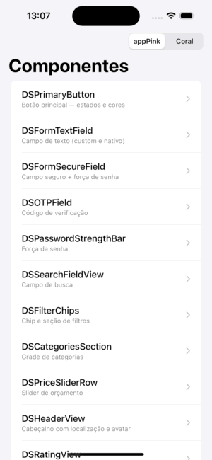

<h1 align="center">🎨 FastNails Design System</h1>

<p align="center">
  <strong>A reusable SwiftUI component library that powers the FastNails app.</strong>
</p>

<p align="center">
  
  
  
  
</p>

<br/>

## 📱 About

The **FastNails Design System** (`UIComponents`) is a standalone Swift Package that centralizes the app's UI: forms, buttons, feedback, search and profile components. It exists as an independent module so it can evolve on its own and be reused across screens without duplicating styling.

Everything is **theme-driven** (a single injectable brand color re-styles the whole system) and **built for accessibility** (VoiceOver labels, adaptive colors for light/dark mode).

<br/>

## ✨ Highlights

- 🎨 **Themeable** — swap the brand color in one place via `DSTheme`, everything follows
- 🌗 **Light & dark mode** — components use adaptive system colors
- ♿ **Accessible by default** — labels, hints and traits baked in
- 🧩 **20+ components** — from auth forms to search and profile UI
- 🖥️ **Live catalog app** — browse every component and its variations

<br/>

## 🎬 Preview

Browse every component in the bundled catalog app — including a live theme switcher:

<p align="center">
  
</p>

<br/>

## 📦 Installation

In Xcode: **File → Add Packages…** and enter the repository URL:

```
https://github.com/BiancaButti/FastNails-DesignSystem-iOS
```

Select a version and add the **`UIComponents`** product to your target.

<br/>

## 🚀 Usage

```swift
import SwiftUI
import UIComponents

struct SignInView: View {
    @State private var email = ""
    @State private var password = ""

    var body: some View {
        VStack(spacing: 16) {
            DSFormTextField(
                label: "E-mail",
                placeholder: "you@email.com",
                text: $email,
                icon: "envelope"
            )

            DSFormSecureField(
                label: "Password",
                placeholder: "Your password",
                text: $password,
                icon: "lock"
            )

            DSPrimaryButton(title: "Sign in") {
                // handle sign in
            }
        }
        .padding()
    }
}
```

### 🎨 Theming

Inject a `DSTheme` to re-brand the whole component tree — no changes to the components themselves:

```swift
SignInView()
    .dsTheme(DSTheme(brandColor: .pink)) // or any brand color
```

Design tokens keep spacing and corners consistent: `DSSpacing` (`.xs`…`.xxl`) and `DSRadius` (`.sm`…`.xxl`).

<br/>

## 🧩 Components

**Forms & auth**
`DSPrimaryButton` · `DSFormTextField` · `DSFormSecureField` · `DSOTPField` · `DSPasswordStrengthBar` · `DSOrDivider`

**Feedback**
`DSErrorLabel` · `DSSuccessLabel` · `DSFeedbackLabel` · `DSLoadingView`

**Search & filters**
`DSSearchFieldView` · `DSSearchEmptyStateView` · `DSFilterChipsSection` · `DSFilterChipView` · `DSCategoriesSection` · `DSPriceSliderRow` · `DSPriceRangeSheet` · `DSResultSection`

**Profile & info**
`DSHeaderView` · `DSManicuristPhotoView` · `DSRatingView` · `DSDistanceView` · `DSStatusBadgeView`

<br/>

## 🖥️ Component catalog (demo app)

A catalog app lets you browse every component with its variations and toggle the theme live.

```bash
cd UIComponents/CatalogDemo
ruby generate_project.rb
```

Then open **`CatalogDemo.xcworkspace`** (the workspace, not the `.xcodeproj`) and run the `CatalogDemo` scheme on an iOS simulator. Opening the workspace is what lets the local package resolve correctly (including `Bundle.module` resources).

> Requires the `xcodeproj` Ruby gem: `gem install xcodeproj`.

<br/>

## 🧪 Tests

```bash
xcodebuild test -scheme UIComponents -destination 'platform=iOS Simulator,name=iPhone 15'
```

<br/>

## 📄 License

Released under the **MIT License** — see [LICENSE](LICENSE).

<br/>

<p align="center">
  <strong>Developed by Bianca Butti</strong><br/>
  <sub>FastNails • iOS Engineering</sub>
</p>
